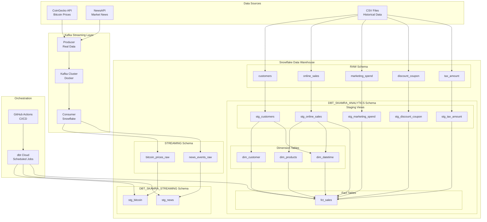
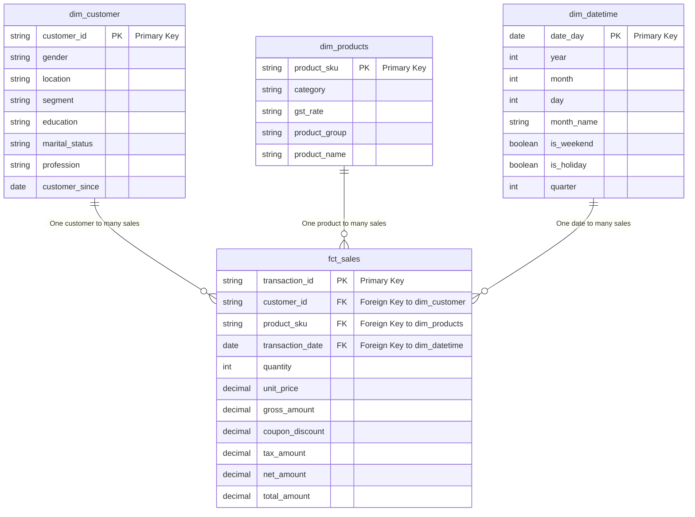

# Marketing Insight Pipeline - Capstone Project

## Project Purpose

This capstone project implements a **comprehensive data engineering pipeline** that combines **batch processing** and **real-time streaming** to deliver marketing analytics insights. The system processes historical sales data alongside real-time market indicators (Bitcoin prices and news events) to create a unified analytical platform.

### Key Features:
- **Batch Processing**: Historical sales, customer, and marketing data using dbt transformations
- **Real-time Streaming**: Live Bitcoin prices and news events via Kafka
- **Data Warehouse**: Snowflake-based architecture with proper schema organization
- **Orchestration**: dbt Cloud scheduling and GitHub Actions CI/CD
- **Data Quality**: Comprehensive testing with 51+ data quality tests
- **Modeling**: Dimensional modeling approach with star schema design

---

## Project Architecture

### High-Level Data Flow



### Data Processing Layers

1. **Raw Layer**:
   - `STREAMING` schema: Real-time data from Kafka (bitcoin_prices_raw, news_events_raw)
   - `RAW` schema: Historical CSV data (customers, online_sales, marketing_spend, etc.)

2. **Staging Layer**:
   - `DBT_SKAMRA_STREAMING`: Processed streaming data (stg_bitcoin, stg_news)
   - `DBT_SKAMRA_ANALYTICS`: Processed batch data (5 staging views)

3. **Analytics Layer**:
   - `DBT_SKAMRA_ANALYTICS`: Business-ready tables (3 dimensions + 1 fact table)

---

## Entity Relationship Diagram (ERD)

### Data Model: Star Schema Design



### ERD Rationale

**Star Schema Design Choice:**
- **Business User Friendly**: Intuitive fact/dimension structure for analysts
- **Performance Optimized**: Denormalized design minimizes JOINs for analytical queries
- **Scalable**: Easy to add new dimensions without affecting existing structure
- **Time Intelligence**: Complete date dimension supports time-series analysis

**Relationship Structure:**
- **One-to-Many**: Each dimension can relate to multiple fact records
- **Clear Foreign Keys**: Explicit FK relationships ensure data integrity
- **Surrogate Keys**: Business keys used for natural relationships
- **Additive Facts**: All monetary measures can be safely aggregated

---

## Technical Implementation

### CI/CD & DevOps
**Implementation:**
- GitHub Actions workflow: `.github/workflows/dbt_ci.yml`
- Automated dbt tests and linting on pull requests
- Integration with dbt Cloud for production deployments

**Validation Commands:**
```bash
# Run CI workflow locally (requires GitHub CLI)
gh workflow run dbt_ci.yml

# Check workflow status
gh run list --workflow=dbt_ci.yml
```

### Real-Time Streaming Pipeline

#### Kafka Infrastructure
**Implementation:**
- Kafka cluster via Docker Compose: `kafka_streaming/docker-compose.yml`
- Producer: `kafka_streaming/producer_real_data.py` (CoinGecko + NewsAPI)
- Consumer: `kafka_streaming/consumer_snowflake.py` (Snowflake integration)
- Topics: `bitcoin-prices`, `news-events`

**Validation Commands:**
```bash
# Start Kafka cluster
cd kafka_streaming
docker-compose up -d

# Run producer (in separate terminal)
python producer_real_data.py

# Run consumer (in separate terminal)
python consumer_snowflake.py

# Verify data ingestion in Snowflake STREAMING schema
```

#### Data Ingestion & Latency
**Implementation:**
- Data latency: ~30 seconds for Bitcoin, ~60 seconds for News
- Direct Snowflake ingestion via consumer
- Tables: `STREAMING.bitcoin_prices_raw`, `STREAMING.news_events_raw`

### dbt Data Transformation

#### Production Orchestration
**Implementation:**
- dbt Cloud with scheduled jobs
- Job: "Streaming Data Materialization" (hourly)
- Command: `dbt run --select tag:streaming`

**Validation Commands:**
```bash
# Test dbt Cloud connection
dbt debug

# Manual job trigger via dbt Cloud UI
```

#### Data Model Architecture
**Implementation:**
- 11 total dbt models across staging and marts layers
- Medallion architecture: Bronze → Silver → Gold
- Models: 5 staging views + 3 dimension tables + 1 fact table + 2 streaming models

**Validation Commands:**
```bash
cd dbt_pipeline

# Run all models
dbt run

# Run specific layers
dbt run --select marts
dbt run --select stg
dbt run --select tag:streaming
```

#### Incremental Processing
**Implementation:**
- `fct_sales`: Incremental fact table with merge strategy
- `stg_bitcoin`: Incremental streaming model with event_timestamp
- `stg_news`: Incremental streaming model with event_timestamp

**Validation Commands:**
```bash
# Test incremental runs
dbt run --select fct_sales
dbt run --select tag:streaming

# Full refresh if needed
dbt run --select fct_sales --full-refresh
```

#### Data Quality & Testing
**Implementation:**
- Generic tests: Primary keys, foreign keys, not_null, unique
- Singular tests: Business logic validation
- Total: 51 tests across all models

**Validation Commands:**
```bash
# Run all tests
dbt test

# Run tests by category
dbt test --select stg
dbt test --select marts
dbt test --select tag:streaming

# Specific test types
dbt test --select test_type:generic
dbt test --select test_type:singular
```

#### Custom Development
**Implementation:**
- Custom macro: `calculate_total_amount.sql`
- Jinja logic for dynamic SQL generation
- Used in `fct_sales` model

**Validation Commands:**
```bash
# Compile and check macro usage
dbt compile --select fct_sales

# Run model using custom macro
dbt run --select fct_sales
```

### Documentation & Lineage
**Implementation:**
- Column documentation in schema.yml files
- Model descriptions and business logic
- Data lineage via dbt docs

**Validation Commands:**
```bash
# Generate documentation
dbt docs generate

# Serve documentation locally
dbt docs serve
```

### Data Modeling Approach

#### Design Philosophy
**Implementation:**
- **Approach**: Dimensional Modeling with Star Schema
- **Rationale**: Optimized for analytical workloads, business user accessibility
- **Alternative Considerations**: Data Vault 2.0 and 3NF evaluated and rejected for complexity/performance reasons
- **Documentation**: Detailed design rationale in `dbt_pipeline/DATA_MODELING_APPROACH.md`

### Technology Stack & Advanced Features

#### Core Technologies
- **Snowflake**: Data warehouse platform
- **Kafka**: Real-time streaming
- **dbt Cloud**: Orchestration and scheduling
- **GitHub Actions**: CI/CD automation
- **Docker**: Containerization

#### Advanced Capabilities
- **Real-time API Integration**: Live data from CoinGecko and NewsAPI
- **Advanced dbt Techniques**: Custom macros, incremental models, comprehensive testing
- **Production Orchestration**: Automated scheduling with dbt Cloud

---

## Testing & Validation Commands

### Complete Pipeline Test
```bash
# 1. Test dbt project
cd dbt_pipeline
dbt debug
dbt deps
dbt run
dbt test

# 2. Test streaming pipeline
cd ../kafka_streaming
docker-compose up -d
python producer_real_data.py &
python consumer_snowflake.py &

# 3. Test incremental processing
cd ../dbt_pipeline
dbt run --select tag:streaming

# 4. Validate data quality
dbt test --select tag:streaming
```

### Individual Component Tests
```bash
# Test batch processing
dbt run --select marts
dbt test --select marts

# Test streaming processing
dbt run --select stream_stg
dbt test --select stream_stg

# Test specific models
dbt run --select fct_sales
dbt test --select fct_sales

# Test data relationships
dbt test --select test_type:relationship
```

### Performance & Monitoring
```bash
# Check model performance
dbt run --select fct_sales --profiles-dir .

# Generate fresh documentation
dbt docs generate
dbt docs serve

# Check logs
tail -f logs/dbt.log
```

### Demo Commands for Live Presentation
```bash
# Complete pipeline demonstration
cd dbt_pipeline

echo "=== Testing dbt Connection ==="
dbt debug

echo "=== Installing Dependencies ==="
dbt deps

echo "=== Running All Models ==="
dbt run

echo "=== Running All Tests (51 total) ==="
dbt test

echo "=== Showing Model Lineage ==="
dbt docs generate
dbt docs serve

echo "=== Testing Streaming Models ==="
dbt run --select tag:streaming
dbt test --select tag:streaming

echo "=== Testing Incremental Loads ==="
dbt run --select fct_sales

echo "=== Testing Custom Macro ==="
dbt compile --select fct_sales

echo "=== Testing by Layer ==="
dbt test --select marts
dbt test --select stg
```

---

## Quick Start Guide

1. **Clone Repository**: `git clone <repository-url>`
2. **Setup dbt**: `cd dbt_pipeline && dbt deps`
3. **Configure Snowflake**: Update connection details in `profiles.yml`
4. **Start Streaming**: `cd kafka_streaming && docker-compose up -d`
5. **Run Pipeline**: `dbt run && dbt test`
6. **Monitor**: Check dbt Cloud dashboard for scheduled jobs

This comprehensive pipeline demonstrates modern data engineering practices with both batch and real-time processing capabilities.
