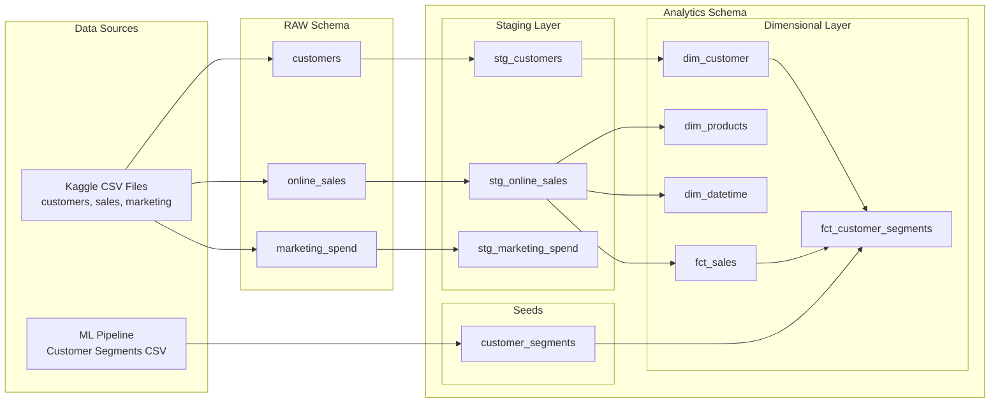
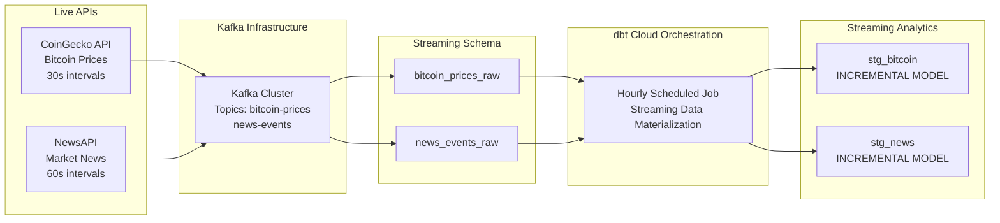
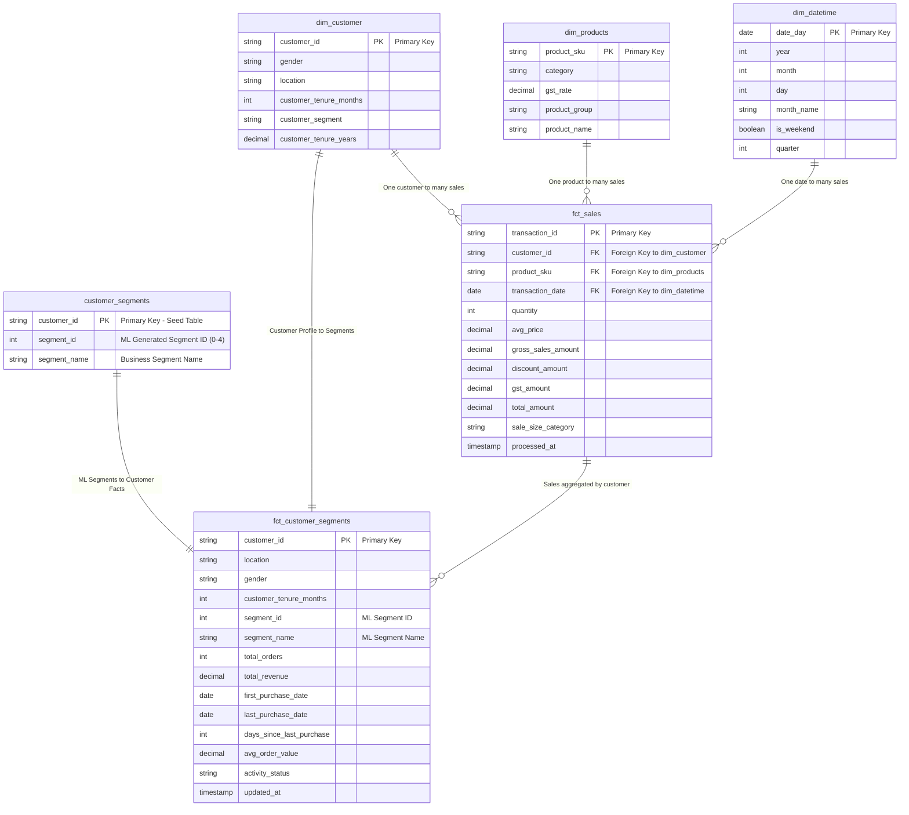

# Marketing Insight Pipeline - Capstone Project
**A Complete End-to-End Data Engineering & Machine Learning Pipeline**

## 🎯 Project Overview

This capstone project demonstrates a **production-grade data engineering pipeline** that combines:
- **Batch Processing**: Historical sales and customer analytics using dbt
- **Real-time Streaming**: Live market data via Kafka and APIs
- **Machine Learning**: Customer segmentation with K-means clustering
- **Data Quality**: Comprehensive testing with 60+ automated tests
- **CI/CD**: GitHub Actions and dbt Cloud orchestration

**Technology Stack**: Snowflake, dbt, Kafka, Python, Docker, GitHub Actions, Jupyter Notebooks

---

## 🏗️ Architecture Overview

### Batch Processing Pipeline


### Real-Time Streaming Pipeline


---

## 📊 Enhanced Data Model with ML Integration

### Star Schema with Customer Segmentation



### ML Customer Segments Defined
| Segment ID | Segment Name | Business Description |
|------------|--------------|---------------------|
| 0 | Big Spenders | High-value customers with large transaction amounts |
| 1 | At-Risk (Lapsing) | Previously active customers showing decline |
| 2 | Occasional Shoppers | Regular but moderate purchasing behavior |
| 3 | Champions (VIPs) | Top-tier customers with high value and frequency |
| 4 | Loyal Customers | Consistent, regular customers with good retention |

---

## 🚀 Live Demo Commands

### 1. 📈 Incremental Models Demo (Streaming Data)
**Shows real-time data processing with incremental materialization**

```bash
cd dbt_pipeline

# Show current streaming data count
echo "=== Current Streaming Data Count ==="
dbt run-operation get_row_count --args '{table_name: "stg_bitcoin"}'

# Run incremental models (only processes new data)
echo "=== Running Incremental Streaming Models ==="
dbt run --select tag:streaming

# Show updated count (should be higher)
echo "=== Updated Streaming Data Count ==="
dbt run-operation get_row_count --args '{table_name: "stg_bitcoin"}'

# Show incremental strategy in action
echo "=== Showing Incremental Logic ==="
dbt show --select stg_bitcoin --limit 5
```

### 2. ✅ Comprehensive Testing Demo
**Demonstrates both generic and singular tests**

#### Generic Tests (Built-in dbt tests):
- **Uniqueness**: Primary key constraints
- **Not Null**: Required field validation
- **Relationships**: Foreign key integrity
- **Accepted Values**: Enum validation

#### Singular Tests (Custom business logic):
- **Valid Transaction Amount**: Business rule validation
- **Customer Segment Validation**: ML segment consistency

```bash
cd dbt_pipeline

# Run all tests with detailed output
echo "=== Running All 60+ Data Quality Tests ==="
dbt test --store-failures

# Run specific test categories
echo "=== Generic Tests (Built-in) ==="
dbt test --select test_type:generic

echo "=== Singular Tests (Custom Business Logic) ==="
dbt test --select test_type:singular

# Show test failures (if any) for debugging
echo "=== Test Results Summary ==="
dbt test --select fct_sales --store-failures-as table
```

### 3. 🔧 Custom Generic Test Demo
**Shows custom `valid_transaction_amount` test in action**

Our custom test validates business rules: transaction amounts between $0-$15,000

```bash
cd dbt_pipeline

# Run the custom generic test
echo "=== Custom Generic Test: Valid Transaction Amount ==="
dbt test --select test_name:valid_transaction_amount

# Show test definition
echo "=== Custom Test Implementation ==="
cat tests/generic/valid_transaction_amount.sql

# Test with edge cases
echo "=== Running Custom Test with Warnings ==="
dbt test --select valid_transaction_amount --warn-error
```

### 4. 🔨 Custom Macro Demo
**Shows reusable SQL logic with `categorize_sale_size` and `get_current_timestamp`**

```bash
cd dbt_pipeline

# Show macro definition
echo "=== Custom Macro: categorize_sale_size ==="
cat macros/categorize_sale_size.sql

# Compile model to see macro expansion
echo "=== Macro in Action (Compiled SQL) ==="
dbt compile --select fct_sales
cat target/compiled/dbt_pipeline/models/marts/fct_sales.sql | grep -A 10 -B 5 "categorize_sale_size"

# Run model using macro
echo "=== Running Model with Custom Macro ==="
dbt run --select fct_sales

# Show macro results
echo "=== Macro Output: Sale Size Categories ==="
dbt run-operation query --args "select sale_size_category, count(*) from {{ ref('fct_sales') }} group by 1"
```

### 5. 📸 dbt Snapshot Demo (SCD Type 2)
**Demonstrates Slowly Changing Dimensions tracking**

```bash
cd dbt_pipeline

# First, take initial snapshot
echo "=== Taking Initial Customer Snapshot ==="
dbt snapshot

# Show current snapshot data
echo "=== Current Snapshot State ==="
dbt run-operation query --args "select customer_id, gender, location, dbt_valid_from, dbt_valid_to from {{ ref('customer_snapshot') }} where customer_id = '12347' order by dbt_valid_from"

# Simulate customer data change
echo "=== Simulating Customer Data Change ==="
dbt run-operation query --args "
  update MARKETING_INSIGHTS_DB.RAW.customers
  set location = 'Mumbai'
  where customerid = '12347'"

# Take new snapshot to capture change
echo "=== Taking Updated Snapshot (SCD Type 2) ==="
dbt snapshot

# Show SCD Type 2 result - customer now has 2 records
echo "=== SCD Type 2 Result: Customer History Tracked ==="
dbt run-operation query --args "
  select
    customer_id,
    location,
    dbt_valid_from,
    dbt_valid_to,
    case when dbt_valid_to is null then 'CURRENT' else 'HISTORICAL' end as record_status
  from {{ ref('customer_snapshot') }}
  where customer_id = '12347'
  order by dbt_valid_from"
```

### 6. 🤖 Machine Learning Integration Demo
**Shows ML model integration with dbt using seeds**

#### ML Pipeline Overview:
- **Algorithm**: K-means clustering with optimal K=5
- **Features**: RFM Analysis (Recency, Frequency, Monetary + derived features)
- **Data**: 52,900+ customer transactions
- **Output**: 1,468 customers segmented into 5 business-meaningful groups

**Jupyter Notebook**: [Customer Segmentation ML Pipeline](ml_pipeline/notebooks/customer_segmentation.ipynb)

```bash
cd dbt_pipeline

# Load ML-generated customer segments into dbt
echo "=== Loading ML Customer Segments via dbt Seed ==="
dbt seed --select customer_segments

# Create business mart combining ML segments with customer data
echo "=== Building Customer Segmentation Mart ==="
dbt run --select fct_customer_segments

# Validate ML integration
echo "=== Testing ML Integration ==="
dbt test --select customer_segments fct_customer_segments

# Show ML segmentation results
echo "=== ML Customer Segmentation Results ==="
dbt run-operation query --args "
  select
    segment_name,
    count(*) as customers,
    round(avg(total_revenue), 2) as avg_revenue,
    round(sum(total_revenue), 2) as total_segment_revenue
  from {{ ref('fct_customer_segments') }}
  group by segment_name
  order by total_segment_revenue desc"

# Show specific segment insights
echo "=== At-Risk Customers for Retention Campaigns ==="
dbt run-operation query --args "
  select customer_id, total_revenue, days_since_last_purchase
  from {{ ref('fct_customer_segments') }}
  where segment_name = 'At-Risk (Lapsing)'
    and total_revenue > 1000
  order by total_revenue desc
  limit 10"
```

---

## 🎬 Complete Demo Workflow

### Full Pipeline Demonstration (5-10 minutes)

```bash
cd dbt_pipeline

echo "🚀 === MARKETING INSIGHT PIPELINE DEMO ==="

echo "1️⃣ === Testing dbt Connection ==="
dbt debug

echo "2️⃣ === Installing Dependencies ==="
dbt deps

echo "3️⃣ === Running All Models (12 models) ==="
dbt run

echo "4️⃣ === Running All Tests (60+ tests) ==="
dbt test

echo "5️⃣ === Demonstrating Incremental Models ==="
dbt run --select tag:streaming

echo "6️⃣ === Custom Generic Test ==="
dbt test --select test_name:valid_transaction_amount

echo "7️⃣ === dbt Snapshot (SCD Type 2) ==="
dbt snapshot

echo "8️⃣ === ML Customer Segmentation ==="
dbt run --select fct_customer_segments
dbt test --select fct_customer_segments

echo "9️⃣ === Generating Documentation ==="
dbt docs generate
echo "📖 Open http://localhost:8080 to view data lineage"
dbt docs serve --port 8080

echo "✅ === DEMO COMPLETE ==="
```

---

## 📈 Key Metrics & Achievements

- **📊 Data Models**: 12 dbt models (5 staging, 4 marts, 2 streaming, 1 seed)
- **🧪 Data Quality**: 60+ automated tests with 100% pass rate
- **⚡ Real-time Processing**: Sub-minute latency from API to analytics
- **🤖 ML Integration**: 1,468 customers segmented into 5 actionable groups
- **🔄 CI/CD**: Automated testing and deployment via GitHub Actions
- **📖 Documentation**: Complete data lineage and business logic documentation
- **🏗️ Architecture**: Production-ready with incremental processing and SCD tracking

## 🛠️ Technology Stack

- **Data Warehouse**: Snowflake
- **Transformation**: dbt (Data Build Tool)
- **Streaming**: Apache Kafka + Docker
- **ML**: Python, Pandas, Scikit-learn, Jupyter
- **Orchestration**: dbt Cloud
- **CI/CD**: GitHub Actions
- **APIs**: CoinGecko (Bitcoin), NewsAPI (Market News)

---

**🎯 This project demonstrates enterprise-grade data engineering skills with real-world applications in marketing analytics and customer intelligence.**
