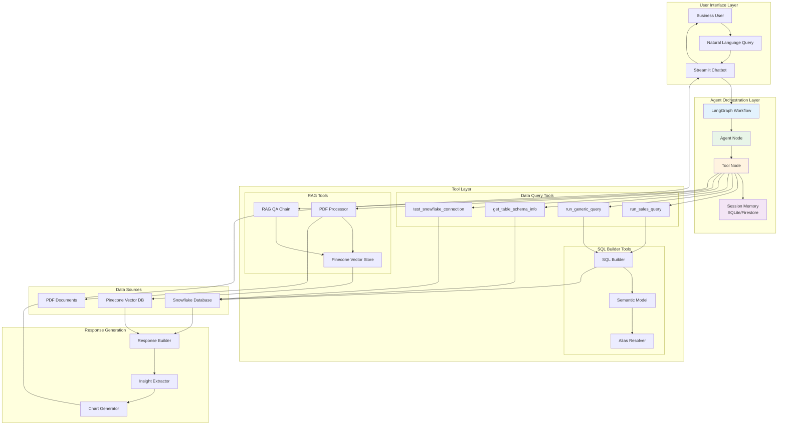

# AI Agent Workflow - LangGraph Architecture

## 🤖 **Slide: AI Agent Workflow - LangGraph Architecture**

---

## **🎯 Agentic AI Flow Overview**

Your Marketing Insight Pipeline uses a sophisticated **LangGraph-based agent** that orchestrates multiple tools and workflows to provide intelligent data analysis and document processing capabilities.

---

## **🏗️ LangGraph Agent Architecture**



---

## **🔄 LangGraph Workflow Steps**

### **Step 1: Query Understanding & Intent Recognition**
```python
# Agent Node Processing
def _agent_node(self, state: AgentState) -> AgentState:
    messages = state["messages"]
    response = self.llm_with_tools.invoke(messages)
    return {"messages": state["messages"] + [response]}
```

**What happens:**
- **Natural Language Processing**: Converts business questions to structured intent
- **Tool Selection**: Determines which tools are needed (data query vs document processing)
- **Context Awareness**: Maintains conversation history and user preferences
- **Semantic Understanding**: Maps business concepts to available data tables

### **Step 2: Tool Orchestration & Execution**
```python
# Tool Node with Multiple Capabilities
tools = [
    run_sales_query,        # Sales-specific analytics
    run_generic_query,      # Generic table queries
    get_table_schema_info,  # Schema exploration
    test_snowflake_connection  # Connection validation
]
```

**Available Tools:**
- **📊 Data Query Tools**: Execute SQL queries against Snowflake
- **🔧 SQL Builder**: Generate optimized SQL using semantic models
- **📄 RAG Tools**: Process PDFs and answer document questions
- **🔍 Schema Tools**: Explore available tables and metrics

### **Step 3: Semantic Model Integration**
```python
# Semantic Model Mapping
fct_sales_semantic = {
    "metrics": {
        "total_revenue": "SUM(total_amount)",
        "average_order_value": "AVG(total_amount)"
    },
    "dimensions": {
        "customer_id": "customer_id",
        "month": "TO_CHAR(transaction_date, 'YYYY-MM')"
    },
    "aliases": {
        "revenue": "total_revenue",
        "customer": "customer_id"
    }
}
```

**Semantic Layer Benefits:**
- **Business Language**: Maps natural language to SQL
- **Alias Resolution**: "revenue" → "total_revenue"
- **Metric Calculation**: Pre-defined business metrics
- **Dimension Mapping**: Time, customer, product hierarchies

### **Step 4: Memory & Context Management**
```python
# Session Memory with SQLite/Firestore
class AgentState(TypedDict):
    messages: Annotated[list[BaseMessage], add_messages]
    user_query: str
    extracted_data: str
    analysis_complete: bool
```

**Memory Features:**
- **Session Isolation**: Each conversation has unique session ID
- **Context Persistence**: Remembers user preferences and conversation history
- **Cross-Platform**: SQLite for local, Firestore for cloud deployment
- **Conversation Continuity**: Follow-up questions work seamlessly

---

## **🛠️ Tool Architecture Deep Dive**

### **📊 Data Query Tools**

#### **1. Sales Query Tool**
```python
@tool
def run_sales_query(
    metric: str,           # "total_revenue", "average_discount"
    group_by: str = "",    # "month", "customer_segment"
    start_date: str = "",  # "2024-01-01"
    end_date: str = "",    # "2024-12-31"
    additional_filters: str = ""  # JSON filters
) -> str:
```

**Capabilities:**
- **Pre-built Metrics**: Total sales, average order value, discount analysis
- **Flexible Grouping**: By time, customer segments, product categories
- **Date Filtering**: Range queries, monthly analysis
- **Custom Filters**: JSON-based additional filtering

#### **2. Generic Query Tool**
```python
@tool
def run_generic_query(
    table_name: str,       # "fct_customer_segments"
    metric: str,           # "total_customers"
    group_by: str = "",    # "segment_name"
    limit: int = 100       # Result limiting
) -> str:
```

**Capabilities:**
- **Multi-table Support**: Any table in semantic model
- **Dynamic Metrics**: Table-specific calculations
- **Flexible Dimensions**: Any available dimension
- **Result Control**: Configurable limits and pagination

### **🔧 SQL Builder & Semantic Model**

#### **SQL Generation Process**
```python
def build_sales_query(metric, group_by, filters):
    # 1. Resolve aliases
    metric = resolve_alias(metric, semantic_model, "metric")

    # 2. Get metric expression
    metric_expr = semantic_model["metrics"].get(metric)

    # 3. Build SQL query
    query = f"""
    SELECT {group_expr} AS {group_by}, {metric_expr} AS {metric}
    FROM {table}
    WHERE {where_clauses}
    GROUP BY {group_expr}
    ORDER BY {group_expr}
    """
```

**Features:**
- **Alias Resolution**: "revenue" → "SUM(total_amount)"
- **Metric Validation**: Ensures requested metrics exist
- **SQL Optimization**: Generates efficient queries
- **Error Handling**: Clear error messages for invalid requests

### **📄 RAG (Retrieval-Augmented Generation) Tools**

#### **Document Processing Pipeline**
```python
class RAGService:
    def upload_pdf(self, pdf_path: str, namespace: str = ""):
        # 1. Process PDF into chunks
        documents = self.pdf_processor.process_pdf(pdf_path)

        # 2. Create embeddings
        embeddings = self.vector_store.create_embeddings(documents)

        # 3. Store in Pinecone
        self.vector_store.upsert(embeddings, namespace)
```

**RAG Capabilities:**
- **PDF Processing**: Text extraction and chunking
- **Vector Embeddings**: OpenAI embeddings for semantic search
- **Pinecone Storage**: Scalable vector database
- **QA Chain**: Context-aware question answering

---

## **🎯 Agentic Workflow Examples**

### **Example 1: Sales Analytics Query**
```
User: "What were total sales last month?"

1. Intent Recognition: Sales query with time filter
2. Tool Selection: run_sales_query
3. Parameter Mapping:
   - metric: "total_revenue"
   - month: "2024-12"
4. SQL Generation:
   SELECT SUM(total_amount) AS total_revenue
   FROM fct_sales
   WHERE TO_CHAR(transaction_date, 'YYYY-MM') = '2024-12'
5. Result Processing: Format and return insights
```

### **Example 2: Customer Segmentation Analysis**
```
User: "Show me customer segments by revenue"

1. Intent Recognition: Customer analysis with grouping
2. Tool Selection: run_generic_query
3. Parameter Mapping:
   - table_name: "fct_customer_segments"
   - metric: "total_revenue"
   - group_by: "segment_name"
4. SQL Generation:
   SELECT segment_name, SUM(total_revenue) AS total_revenue
   FROM fct_customer_segments
   GROUP BY segment_name
5. Result Processing: Format with business context
```

### **Example 3: Document Question**
```
User: "What does the marketing report say about Q4 performance?"

1. Intent Recognition: Document query
2. Tool Selection: RAG QA Chain
3. Document Retrieval: Search Pinecone for relevant chunks
4. Context Building: Combine retrieved documents
5. Answer Generation: Generate response with sources
```

---

## **🚀 Key Features & Benefits**

### **🤖 Intelligent Agent Capabilities**
- **Context Awareness**: Remembers conversation history and user preferences
- **Tool Selection**: Automatically chooses appropriate tools for each query
- **Error Recovery**: Handles failures gracefully with helpful error messages
- **Multi-modal Support**: Handles both data queries and document questions

### **📊 Business Intelligence**
- **Natural Language Interface**: No SQL knowledge required
- **Semantic Understanding**: Maps business terms to technical concepts
- **Real-time Analytics**: Live data from Snowflake
- **Insight Generation**: AI-powered analysis and recommendations

### **🔧 Technical Excellence**
- **Scalable Architecture**: LangGraph for complex workflows
- **Memory Management**: Session-based conversation memory
- **Tool Orchestration**: Seamless integration of multiple tools
- **Error Handling**: Robust error handling and recovery

### **📈 Business Impact**
- **Democratized Analytics**: Business users can query data directly
- **Faster Insights**: Real-time data access and analysis
- **Reduced Dependencies**: Self-service analytics reduces IT burden
- **Better Decisions**: Data-driven insights for strategic planning

---

## **🔄 Workflow Decision Logic**

### **Tool Selection Algorithm**
```python
def _should_continue(self, state: AgentState) -> str:
    messages = state["messages"]
    last_message = messages[-1]

    # If tool calls exist, continue to tools
    if hasattr(last_message, 'tool_calls') and last_message.tool_calls:
        return "continue"
    else:
        return "end"
```

### **Memory Management**
```python
# Session-based memory isolation
session_id = str(uuid.uuid4())
config = {"configurable": {"thread_id": session_id}}

# Cloud memory for deployment
cloud_memory.save_session(
    session_id=session_id,
    messages=message_data,
    metadata={"query": user_query, "mode": "data_extraction"}
)
```

---

**This LangGraph agent architecture provides a sophisticated, scalable foundation for AI-powered business intelligence, enabling natural language interaction with complex data systems while maintaining context and delivering actionable insights.**
