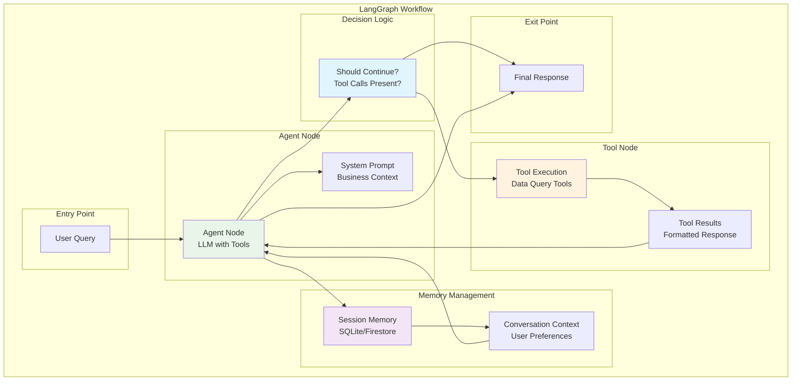

# Simplified Agentic AI Workflow

## 🤖 **Slide: Agentic AI Workflow - High-Level Overview**

---

## **🎯 How Our AI Agent Works**

Your Marketing Insight Pipeline uses an **intelligent AI agent** that understands business questions in plain English and automatically finds the right data to answer them.

---

## **🔄 Simple 4-Step Process**

```mermaid
graph LR
    subgraph "Step 1: Understand"
        USER[Business User<br/>Natural Language Query]
        AI[AI Agent<br/>Understands Intent]
    end

    subgraph "Step 2: Plan"
        PLAN[Agent Plans<br/>Which Data to Query]
        TOOLS[Selects Tools<br/>Data Query or Documents]
    end

    subgraph "Step 3: Execute"
        DATA[Queries Database<br/>Snowflake Tables]
        PROCESS[Processes Results<br/>Finds Insights]
    end

    subgraph "Step 4: Respond"
        INSIGHT[Generates Insights<br/>Business Context]
        ANSWER[Returns Answer<br/>With Visualizations]
    end

    USER --> AI
    AI --> PLAN
    PLAN --> TOOLS
    TOOLS --> DATA
    DATA --> PROCESS
    PROCESS --> INSIGHT
    INSIGHT --> ANSWER

    style USER fill:#e3f2fd
    style AI fill:#e8f5e8
    style PLAN fill:#fff3e0
    style DATA fill:#f3e5f5
    style INSIGHT fill:#e1f5fe
    style ANSWER fill:#f1f8e9
```



---

## **🎯 Step-by-Step Breakdown**

### **Step 1: Understanding Your Question**
**What happens:** The AI agent reads your question and understands what you're asking for.

**Example:**
- **You ask:** "What were total sales last month?"
- **AI understands:** You want sales data for the previous month, grouped by total revenue

### **Step 2: Planning the Response**
**What happens:** The agent decides which data sources to check and how to get the information.

**Example:**
- **AI plans:** Query the sales table, filter by last month, calculate total revenue
- **Tool selection:** Chooses the sales query tool for this type of question

### **Step 3: Getting the Data**
**What happens:** The agent connects to your database and retrieves the relevant information.

**Example:**
- **Database query:** Searches through 52,000+ transactions
- **Data processing:** Filters, calculates, and organizes the results
- **Real-time access:** Gets live data from your Snowflake database

### **Step 4: Delivering Insights**
**What happens:** The agent analyzes the data and presents it in a business-friendly way.

**Example:**
- **Insight generation:** "Total sales last month were $2.3M, up 15% from previous month"
- **Visualization:** Creates charts and graphs automatically
- **Business context:** Explains what the numbers mean for your business

---

## **🛠️ Available Capabilities**

### **📊 Data Analysis Tools**
- **Sales Analytics**: Revenue, discounts, order values, trends
- **Customer Intelligence**: Segments, behavior, lifetime value
- **Product Performance**: Categories, profitability, demand
- **Real-time Data**: Live Bitcoin prices and market sentiment

### **📄 Document Processing**
- **PDF Upload**: Upload marketing reports, presentations, documents
- **Smart Search**: Ask questions about document content
- **Source Tracking**: Get answers with document references

### **🔍 Schema Exploration**
- **Table Discovery**: See what data is available
- **Metric Understanding**: Learn what business metrics exist
- **Data Quality**: Validate data connections and accuracy

---

## **💬 Real-World Examples**

### **Example 1: Sales Analysis**
```
You: "What were total sales last month?"
AI: "Let me check your sales data for last month..."

Result: "Total sales in December 2024 were $2.3M, which is a 15% increase
from November. The top performing category was Electronics with $450K in sales."
```

### **Example 2: Customer Insights**
```
You: "Which customer segments are most profitable?"
AI: "I'll analyze your customer segmentation data..."

Result: "Your 'Champions (VIPs)' segment is most profitable with an average
lifetime value of $8,500. They represent 12% of customers but 35% of revenue."
```

### **Example 3: Document Questions**
```
You: "What does the Q4 marketing report say about campaign performance?"
AI: "Let me search through your uploaded marketing documents..."

Result: "According to your Q4 marketing report, the email campaign achieved
a 25% open rate and generated $180K in revenue. The social media campaign
had the highest ROI at 320%."
```

---

## **🧠 Intelligent Features**

### **🎯 Context Awareness**
- **Remembers Conversations**: Knows what you've asked before
- **Follow-up Questions**: "How does that compare to Q3?" works seamlessly
- **User Preferences**: Learns your analysis style and preferences

### **🔧 Automatic Tool Selection**
- **Smart Routing**: Automatically chooses data vs document tools
- **Error Handling**: Gracefully handles missing data or connection issues
- **Optimization**: Uses the most efficient way to get your answers

### **📈 Business Intelligence**
- **Natural Language**: No technical knowledge required
- **Real-time Data**: Always gets the latest information
- **Actionable Insights**: Provides business context and recommendations

---

## **🚀 Business Benefits**

### **⚡ Speed & Efficiency**
- **Instant Answers**: Get insights in seconds, not days
- **No IT Dependency**: Business users can query data directly
- **Real-time Decisions**: Make decisions with current data

### **🎯 Better Insights**
- **Contextual Understanding**: AI understands business context
- **Pattern Recognition**: Identifies trends and anomalies
- **Recommendations**: Suggests actions based on data

### **📊 Democratized Analytics**
- **Self-Service**: No need for technical training
- **Natural Interface**: Ask questions in plain English
- **Visual Results**: Automatic charts and graphs

---

## **🔄 Conversation Flow Example**

```
User: "Hi, I'm Sarah from marketing and I need to analyze Q4 performance."

AI: "Hello Sarah! I'm ready to help you analyze Q4 performance.
What specific aspects would you like to look at?"

User: "What were our total sales?"

AI: "Let me check your Q4 sales data...
Total sales in Q4 2024 were $6.8M, which is a 22% increase from Q3.
The strongest month was December with $2.3M in sales."

User: "How does that compare to last year?"

AI: "Comparing to Q4 2023, your sales grew by 18%.
Last year's Q4 total was $5.8M, so you've added $1M in revenue."

User: "Which customer segments drove this growth?"

AI: "The 'Champions (VIPs)' segment contributed 40% of Q4 growth,
followed by 'Loyal Customers' at 35%. Your retention strategies
are working well!"
```

---

## **🎯 Key Takeaways**

### **🤖 Intelligent Automation**
- **No Manual Work**: AI handles data retrieval and analysis
- **Smart Decisions**: Automatically chooses the best approach
- **Error Recovery**: Handles issues gracefully

### **📊 Business Focus**
- **Natural Language**: Ask questions like you're talking to a colleague
- **Business Context**: Understands marketing, sales, and customer concepts
- **Actionable Results**: Provides insights you can act on immediately

### **🚀 Scalable Solution**
- **Grows with You**: Handles increasing data volumes
- **Multi-modal**: Works with both data and documents
- **Enterprise Ready**: Secure, reliable, and scalable

---

## **🏗️ LangGraph Nodes Architecture**

### **Technical Foundation Behind the Simple Flow**

While the user experience is simple, the technical architecture uses **LangGraph** to orchestrate multiple intelligent nodes:



### **Node Functions**

#### **🔧 Agent Node**
- **Purpose**: Processes user queries and decides on tool usage
- **Function**: LLM with bound tools for intelligent decision making
- **Output**: Tool calls or final response

#### **🛠️ Tool Node**
- **Purpose**: Executes selected tools (data queries, RAG, etc.)
- **Function**: Runs tools and formats results
- **Tools Available**: Sales queries, generic queries, schema info, connection tests

#### **🧠 Memory Node**
- **Purpose**: Maintains conversation context and user preferences
- **Function**: Session-based memory with SQLite/Firestore
- **Features**: Context persistence, session isolation, user preferences

#### **🎯 Decision Logic**
- **Purpose**: Determines workflow continuation
- **Logic**: If tool calls exist → continue to tools, else → end
- **Result**: Conditional routing through the workflow

### **State Management**

```python
class AgentState(TypedDict):
    messages: list[BaseMessage]      # Conversation history
    user_query: str                 # Current user question
    extracted_data: str             # Data from tools
    analysis_complete: bool         # Workflow status
```

### **Workflow Benefits**

#### **🔄 Scalable Architecture**
- **Modular Design**: Easy to add new tools and capabilities
- **State Management**: Robust conversation state handling
- **Error Recovery**: Graceful handling of failures

#### **🧠 Intelligent Routing**
- **Automatic Tool Selection**: AI chooses appropriate tools
- **Context Awareness**: Maintains conversation flow
- **Optimized Execution**: Efficient data retrieval and processing

#### **📊 Business Intelligence**
- **Semantic Understanding**: Maps business language to technical queries
- **Real-time Processing**: Live data access and analysis
- **Insight Generation**: AI-powered business recommendations

---

**This LangGraph nodes architecture provides the sophisticated technical foundation that enables the simple, intuitive user experience - transforming complex data operations into natural conversations.**
