# Star Schema - Data Modeling

## 📊 **Slide: Star Schema - Data Modeling**

---

## **Our Data Architecture: Star Schema Design**

### 🎯 **What is Star Schema?**
A **dimensional modeling approach** that organizes data into **facts** (business events) and **dimensions** (descriptive attributes) for fast, intuitive analytics.

---

## **📈 Star Schema Structure**

```mermaid
graph LR
    subgraph "Dimension Tables"
        DIM_CUST[dim_customer<br/>Customer Profiles<br/>• customer_id<br/>• gender<br/>• location<br/>• tenure<br/>• segment]

        DIM_PROD[dim_products<br/>Product Catalog<br/>• product_sku<br/>• category<br/>• gst_rate<br/>• product_group]

        DIM_DATE[dim_datetime<br/>Time Intelligence<br/>• date_day<br/>• year<br/>• month<br/>• month_name<br/>• is_weekend]
    end

    subgraph "Fact Tables"
        FCT_SALES[fct_sales<br/>Sales Transactions<br/>• transaction_id<br/>• customer_id<br/>• product_sku<br/>• transaction_date<br/>• quantity<br/>• total_amount<br/>• discount_amount<br/>• sale_size_category]

        FCT_SEGMENTS[fct_customer_segments<br/>Customer Segments<br/>• customer_id<br/>• segment_id<br/>• segment_name<br/>• total_orders<br/>• total_revenue<br/>• activity_status]
    end

    DIM_CUST --> FCT_SALES
    DIM_PROD --> FCT_SALES
    DIM_DATE --> FCT_SALES
    FCT_SEGMENTS --> DIM_CUST

    style DIM_CUST fill:#e1f5fe
    style DIM_PROD fill:#e1f5fe
    style DIM_DATE fill:#e1f5fe
    style FCT_SALES fill:#f3e5f5
    style FCT_SEGMENTS fill:#f3e5f5
```



---

## **🎯 Key Components**

### **📊 Fact Tables (Business Events)**
- **fct_sales**: Every transaction with financial metrics
- **fct_customer_segments**: Customer behavior and ML insights

### **📋 Dimension Tables (Descriptive Data)**
- **dim_customer**: Customer profiles and demographics
- **dim_products**: Product catalog and categories
- **dim_datetime**: Time intelligence for trend analysis

---

## **🚀 Business Benefits**

### **⚡ Performance Excellence**
- **Lightning Fast Queries**: Sub-second response times for complex analytics
- **Efficient Aggregations**: Pre-calculated metrics for instant insights
- **Optimized Storage**: Denormalized structure reduces JOIN complexity

### **🎯 Business User Friendly**
- **Intuitive Structure**: Easy to understand fact/dimension relationships
- **Self-Service Analytics**: Business users can query without technical knowledge
- **Flexible Analysis**: Slice-and-dice across any dimension combination

### **📈 Scalable Design**
- **Independent Growth**: Fact tables can scale separately from dimensions
- **Easy Extensions**: Add new dimensions without major system changes
- **Multiple Grain Levels**: Support both detailed and summary analysis

---

## **💡 Key Features**

### **📊 Multi-Dimensional Analysis**
- **Customer Intelligence**: Analyze by demographics, segments, behavior
- **Product Performance**: Track by category, group, pricing strategy
- **Time Intelligence**: Trend analysis by day, month, quarter, year
- **Geographic Insights**: Performance by location and region

### **🤖 ML Integration Ready**
- **Customer Segments**: ML-generated segments integrated seamlessly
- **Predictive Analytics**: Framework for advanced ML model integration
- **Real-time Scoring**: Live customer behavior updates

### **📈 Business Metrics**
- **Revenue Analytics**: Gross sales, net sales, discounts, taxes
- **Customer Metrics**: Lifetime value, purchase frequency, recency
- **Product Performance**: Sales volume, profitability, category analysis
- **Operational KPIs**: Order values, delivery charges, coupon usage

---

## **🎯 Real-World Applications**

### **📊 Sales Analytics**
```
"Show me sales by customer segment for Q4"
"Compare product performance across locations"
"Analyze discount effectiveness by customer type"
```

### **👥 Customer Intelligence**
```
"Identify high-value customers by location"
"Find at-risk customers for retention campaigns"
"Analyze customer lifetime value trends"
```

### **📈 Marketing Optimization**
```
"Track campaign performance by segment"
"Analyze coupon usage patterns"
"Measure marketing spend ROI by channel"
```

---

## **🔧 Technical Advantages**

### **🏗️ Architecture Benefits**
- **Data Quality**: Built-in validation and testing framework
- **Incremental Processing**: Only new data processed for efficiency
- **Audit Trail**: Complete data lineage and change tracking
- **Flexible Materialization**: Views, tables, and incremental models

### **📊 Analytics Capabilities**
- **Ad-hoc Queries**: Flexible analysis without predefined reports
- **Drill-down Analysis**: From summary to detailed transaction level
- **Cross-dimensional Analysis**: Combine any dimensions for insights
- **Time-series Analysis**: Trend identification and forecasting

---

## **📈 Business Impact**

### **💰 Revenue Optimization**
- **Targeted Marketing**: Segment-specific campaign optimization
- **Pricing Strategy**: Data-driven pricing and discount decisions
- **Inventory Management**: Product demand forecasting and optimization

### **🎯 Customer Experience**
- **Personalization**: Segment-based product recommendations
- **Retention Strategies**: Proactive customer engagement
- **Lifetime Value**: Maximize customer profitability

### **⚡ Operational Efficiency**
- **Faster Insights**: Real-time analytics for immediate decisions
- **Reduced Dependencies**: Self-service analytics for business users
- **Data-Driven Culture**: Evidence-based decision making

---

## **🚀 Why Star Schema Matters**

### **🎯 Business Transformation**
- **From Reports to Insights**: Move beyond static reporting to dynamic analysis
- **From IT-Dependent to Self-Service**: Empower business users with data access
- **From Historical to Real-Time**: Enable proactive decision making

### **📊 Competitive Advantage**
- **Faster Decision Making**: Sub-second query response times
- **Better Customer Understanding**: 360° view of customer behavior
- **Optimized Operations**: Data-driven process improvements

### **🔮 Future-Ready**
- **Scalable Architecture**: Grows with business needs
- **ML Integration**: Framework for advanced analytics
- **Real-time Capabilities**: Foundation for streaming analytics

---

**Our Star Schema design transforms complex data into intuitive business insights, enabling faster, smarter, and more profitable decision making across the organization.**
